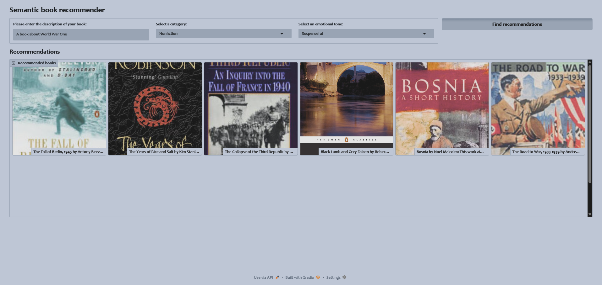
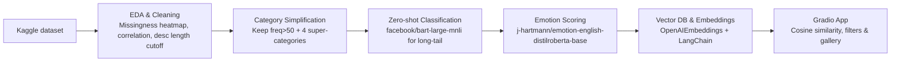

# Semantic Book Recommender — End-to-End LLM Pipeline

A complete, admissions-ready project that takes a raw Kaggle books dataset and turns it into a **semantic, emotion-aware book recommendation app** with a clean **Gradio** UI.  
It demonstrates both **theory** (representation learning, similarity search, zero-shot classification) and **practice** (EDA → data cleaning → LLM-powered enrichment → interactive dashboard).

> **Why this is compelling for MS (DS/AI) admissions**
> - Shows mastery of the *full lifecycle*: data ingestion, exploratory analysis, modeling choices, evaluation of trade-offs, and deployment.  
> - Uses **three** distinct LLM capabilities: embeddings for semantic search, **zero-shot** topic classification, and **emotion** analysis.  
> - Clear engineering: reproducible notebooks, modular code, environment variables, and a one-command app.

---

## 📌 TL;DR
- **Input:** Kaggle books dataset (titles, subtitles, categories, descriptions, ISBN, etc.).  
- **Process:** EDA & cleaning → category simplification → zero-shot mapping → emotion scoring → vector DB → cosine similarity retrieval.  
- **Output:** A **Gradio dashboard** that returns **semantic recommendations** for any user query, filterable by **genre** (4 categories) and **emotion** (Ekman + neutral).

## 🎥 Demo

<p align="center">
  
</p>

*Example:* Query: “A book about World War One” · Category: **Nonfiction** · Emotion: **Suspenseful**.

---

## 🧭 Project Structure
```
semantic-book-recommender/
├── app/
│   └── gradio-dashboard.py          # End-user app: semantic retrieval + filters + gallery UI
├── notebooks/
│   ├── data-exploration.ipynb       # EDA: missingness, correlations, desc length cutoff, merges, save cleaned data
│   ├── vector-search.ipynb          # Practice: LangChain + OpenAIEmbeddings + similarity_search (scratchpad)
│   ├── text-classification.ipynb    # Category pruning (>50 freq), map into 4 genres, zero-shot classify long-tail
│   └── sentiment-analysis.ipynb     # Emotion scoring via j-hartmann/emotion-english-distilroberta-base
├── data/
│   ├── books_cleaned.csv
│   ├── books_with_categories.csv
│   ├── books_with_emotions.csv
│   └── tagged_description_Updated.txt
├── assets/
│   ├── cover-not-found.jpg          # Fallback image for missing book covers
│   └── gradio-dashboard.png         # README demo screenshot
├── scripts/
│   ├── run_app.sh                   # Helper scripts to launch the app
│   └── run_app.bat
├── requirements.txt
├── .env.example
├── .gitignore
├── LICENSE
└── README.md
```

---

## 🏗️ Architecture (Mermaid)


---

## ✨ Key Features
- **Semantic Retrieval:** OpenAI embeddings + cosine similarity surface conceptually similar books to a natural-language query.
- **Smart Filtering:** Filter by **Genre** (Fiction, Non-Fiction, Juvenile Fiction, Non-Juvenile Fiction) and **Emotion** (anger, fear, sadness, disgust, joy, surprise, neutral).
- **Robust EDA:** Missingness heatmaps, correlation analysis to justify dropping short/empty descriptions w/out biasing other dimensions.
- **Zero-Shot Mapping:** Collapse ~500 raw categories into 4 genres; unsupervised mapping for low-frequency categories with BART-MNLI.
- **Emotion Enrichment:** DistilRoBERTa-based classifier adds per-emotion scores as columns for nuanced filtering.
- **Simple UI:** Gradio dashboard renders a clean, responsive gallery with title + subtitle + cover (if present) + meta.

---

## 🔧 Setup

### 1) Python env
```bash
# Python 3.10+ recommended
pip install -r requirements.txt
```

### 2) Environment variables
Copy the template and fill your keys:
```bash
cp .env.example .env
```
**Required (for embeddings):**
- `OPENAI_API_KEY` — for `OpenAIEmbeddings` used via `langchain-openai`

**Optional (if pulling models from HF hub programmatically):**
- `HUGGINGFACE_HUB_TOKEN`

**If you download via Kaggle programmatically (kagglehub):**
- `KAGGLE_USERNAME`, `KAGGLE_KEY` (or a kaggle.json in the standard location)

> You can also run the notebooks without internet if you already have the dataset locally.

---

## 📂 Data Files (used by notebooks & app)

The repo includes CSVs produced at each stage so reviewers can run the app immediately:

- `data/books_cleaned.csv` — output of **`notebooks/data-exploration.ipynb`** after EDA, description-length filtering, title–subtitle merge, and ISBN postfix for lookup.
- `data/books_with_categories.csv` — output of **`notebooks/text-classification.ipynb`** after pruning raw categories (>50 frequency) and mapping all titles into **4 simplified genres** via zero-shot **BART-MNLI**.
- `data/books_with_emotions.csv` — output of **`notebooks/sentiment-analysis.ipynb`** after scoring **7 emotions** (anger, fear, sadness, disgust, joy, surprise, neutral) with **DistilRoBERTa**; includes per-emotion columns and/or a dominant label. **This is the default file consumed by the app.**
- `data/tagged_description_Updated.txt` — line-separated descriptions (used for quick embedding/vectorization experiments in `vector-search.ipynb`).

**Assets**

- `assets/cover-not-found.jpg` — fallback image used by the Gradio gallery when a book cover is unavailable.
- `assets/gradio-dashboard.png` — screenshot used in this README.

---

## 🧪 Reproduce the Pipeline (Notebook flow)

1. **`notebooks/data-exploration.ipynb`**
   - Load dataset (via `kagglehub` or local file)
   - Visualize **missingness heatmap** and **correlation** of key attributes (ratings, num_pages, book_age)
   - Inspect description **length distribution**; decide a cutoff for “meaningful” descriptions
   - Merge `title` + `subtitle` into a canonical display field
   - Append `ISBN` into description text to simplify lookup from search results
   - Save **cleaned** dataframe to `data/books_cleaned.csv`

2. **`notebooks/text-classification.ipynb`**
   - Keep high-frequency categories (threshold > 50)
   - Map into **4 simplified genres**: *fiction*, *non-fiction*, *juvenile fiction*, *non-juvenile fiction*
   - Use **zero-shot classification** with `facebook/bart-large-mnli` to map low-frequency/unknown categories
   - Save **genre-augmented** dataframe to `data/books_with_categories.csv`

3. **`notebooks/sentiment-analysis.ipynb`**
   - Run `j-hartmann/emotion-english-distilroberta-base` to score **7 emotions** (anger, fear, sadness, disgust, joy, surprise, neutral)
   - Keep **max emotion** per description (and/or retain all scores as columns)
   - Save **emotion-enriched** dataframe to `data/books_with_emotions.csv`

4. **`notebooks/vector-search.ipynb`** (optional dev scratchpad)
   - Create embeddings with **OpenAIEmbeddings**
   - Build a vector store (e.g., **Chroma** via LangChain)
   - `similarity_search` experiments and evaluation notes

---

## ▶️ Run the App

By default the app expects `data/books_with_emotions.csv`. Adjust the path in **`app/gradio-dashboard.py`** if you change filenames.

```bash
python app/gradio-dashboard.py
```

Example query ideas:
- “cozy mystery with a hopeful tone” — Genre: *Fiction*, Emotion: *joy*
- “survival story with dread and suspense” — Genre: *Non-Fiction* or *Fiction*, Emotion: *fear*

---

## 🧠 Design Decisions & Justifications
- **Dropping short/empty descriptions:** Backed by **correlation analysis** showing negligible bias introduced w.r.t. ratings, page count, and age.  
- **Genre simplification:** Reduces cognitive load in the UI and avoids sparse/imbalanced categories; **zero-shot** mapping preserves coverage.  
- **Emotion layer:** Adds a *human-centric* axis to re-ranking and filtering (e.g., “joyful coming-of-age mystery”).  
- **Cosine similarity over embeddings:** Standard, interpretable metric for semantic proximity in embedding space.  
- **Gradio front-end:** Lightweight, fast to iterate, easy to demo during interviews or SOP portfolios.

---

## 🧩 Extensibility
- Swap **OpenAIEmbeddings** for local embeddings (e.g., `sentence-transformers`) to run entirely offline.
- Add **re-ranking** with cross-encoder or LLM re-score for improved precision on the top-k.
- Support **faceted search** (authors, year, rating) and add **diversity/novelty** heuristics.
- Cache embeddings & model outputs to cut costs and latency.

---

## 📝 Academic Takeaways (for SOP/Resume)
- Built an **end-to-end pipeline** combining EDA, unsupervised zero-shot labeling, and **emotion-aware** semantic retrieval.  
- Evaluated **data quality** and **representation bias** before modeling; justified filtering choices quantitatively.  
- Engineered a **reproducible** stack (env vars, requirements, modular notebooks + app) and delivered a working demo.

> **Resume bullet (example):**  
> *Designed and deployed a semantic book recommender (5k+ titles) using OpenAI embeddings, zero-shot BART-MNLI for category mapping, and DistilRoBERTa emotion analysis; built a Gradio UI with genre/emotion filtering and cosine similarity retrieval.*

---

## ⚖️ Ethical/Operational Notes
- Embedding & HF model calls may send text to third-party APIs; scrub PII and respect dataset licenses.  
- Provide user controls to disable certain data or opt-out from emotion analysis if using personal text.

---

## 🗺️ Tech Stack
**Python**, **Pandas**, **NumPy**, **Matplotlib/Seaborn**, **LangChain**, **OpenAIEmbeddings**, **Chroma** (or similar vector store), **Hugging Face Transformers**, **PyTorch**, **Gradio**, **kagglehub**, **python-dotenv**.

---

## 📜 License
MIT — see [LICENSE](./LICENSE).
